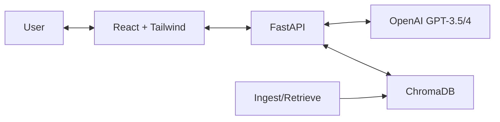

# Domain-Specific AI Chatbot using Retrieval-Augmented Generation (RAG)

## Project Overview
This project is a sophisticated AI-powered chatbot designed to answer user questions based on a specific set of documents. It utilizes a **Retrieval-Augmented Generation (RAG)** architecture to provide accurate, context-aware responses, minimizing hallucinations by grounding answers in your data.

The application features a modern, **ChatGPT-like user interface** built with React and TailwindCSS, and a robust backend powered by FastAPI, ChromaDB, and OpenAI.

## Key Features

### 🧠 Intelligent Question Answering
*   **RAG Architecture**: Retrieves precise context from your uploaded documents to answer questions.
*   **Source Citations**: Every AI response includes citations to the specific source documents used.
*   **Context-Aware**: Maintains conversation context within a chat session.

### 📂 Document Management
*   **Multi-Format Support**: Upload and chat with **.txt**, **.pdf**, and **.docx** files.
*   **Document Preview**: Click on any document in the sidebar to preview its content directly in the app (PDFs supported natively).
*   **Vector Search**: Uses **ChromaDB** with `all-MiniLM-L6-v2` embeddings for semantic search, not just keyword matching.
*   **Persistent Storage**: Documents are ingested into a persistent vector store.

### 💬 Enhanced User Experience
*   **Chat History**: Automatically saves your chat history locally. View and continue past conversations.
*   **New Chat**: Easily start a fresh conversation context.
*   **File Uploads**: Integrated file upload via a paperclip icon in the chat input area.
*   **Status Notifications**: Real-time feedback for file uploads (Success/Error states).
*   **Delete Functionality**: Manage your workspace by deleting old chats or removing documents from the knowledge base.

## System Architecture



## Folder Structure

```
backend/
  main.py           # FastAPI application & API endpoints
  chatbot.py        # Core RAG logic & LLM interaction
  retriever.py      # ChromaDB query logic
  ingest.py         # Document processing (PDF/Docx/Txt) & Vector embedding
  system_prompt.py  # AI persona and instructions
  documents/        # Local storage for uploaded files
  chroma_db/        # Persistent vector database storage

frontend/
  src/
    components/     # UI Components (ChatInterface, Sidebar, MessageList, etc.)
    api/            # API client for backend communication
```

## Setup Instructions

### Prerequisites
*   Python 3.8+
*   Node.js 14+
*   OpenAI API Key

### 1. Backend Setup
Open a terminal in the root directory:

1.  **Create a virtual environment (optional but recommended):**
    ```bash
    python -m venv venv
    source venv/bin/activate  # On Windows: venv\Scripts\activate
    ```

2.  **Install Python dependencies:**
    ```bash
    pip install -r backend/requirements.txt
    ```

3.  **Configure Environment:**
    Create a `.env` file in the root directory and add your OpenAI Key:
    ```
    OPENAI_API_KEY=sk-your-openai-key-here
    ```

4.  **Start the Backend Server:**
    ```bash
    python backend/main.py
    ```
    The server will start on `http://localhost:8000`.

### 2. Frontend Setup
Open a **new** terminal in the `frontend` directory:

1.  **Install Node dependencies:**
    ```bash
    cd frontend
    npm install
    ```

2.  **Start the React App:**
    ```bash
    npm start
    ```
    The application will open at `http://localhost:3000` (or similar port).

## Usage

1.  **Upload Documents**: Click the **paperclip icon** (`+`) next to the message input to upload PDF, TXT, or DOCX files.
2.  **Wait for Processing**: A notification will confirm when the file is successfully ingested.
3.  **Ask Questions**: Type your query in the chat box. The AI will answer based on *only* the uploaded documents.
4.  **Manage**: Use the sidebar to switch between chats, delete history, or remove documents.
5.  **Preview**: Click a document name in the sidebar to view its content.